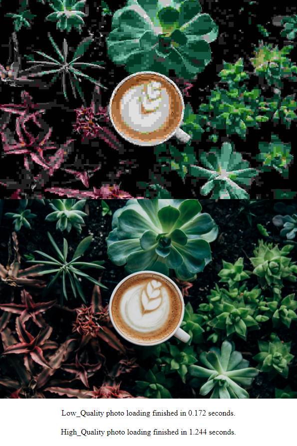

## 100 images in a web page for internet testing

Self-hosting alternative to http://www.http2demo.io/

HTTPS: Replace fields in Caddyfile then run `caddy run` and point your web browser to your domain name.

HTTP: `caddy file-server --listen :80 --root /path/to/your/directory`

High performance file listing with HTTP/1.1 `dufs --port 80 --render-index`

Note: HTTP seems to be slower than HTTPS in some browsers.

## Notable tests (20 sample)

|Test                                               |Results                    |
|---------------------------------------------------|----------------------------|
|SQM cake + layer_cake vs NONE (60ms 100Mbit fiber - Chrome)| 1.3 - 0.3 seconds|
|SQM cake + layer_cake vs NONE (60ms 100Mbit fiber - Safari)| 3 - 0.6 seconds|
|SQM cake + layer_cake vs NONE (60ms 100Mbit fiber - Firefox)| 1.5 - 1.5 seconds|
|60ms 100Mbit + Safari vs Chrome vs Firefox|0.5 - 0.4 - 1.5 seconds|
|Localhost test + Safari vs Chrome vs Firefox|0.2 - 0.3 - 0.1 seconds|

Safari on macOS, Chrome and Firefox on Windows.

## Credits
- Source of original photo: https://www.pexels.com/photo/beautiful-botanical-coffee-decoration-374757/

- Images cut by: https://github.com/atygaev/example-spring-boot-http1.1-vs-http2
